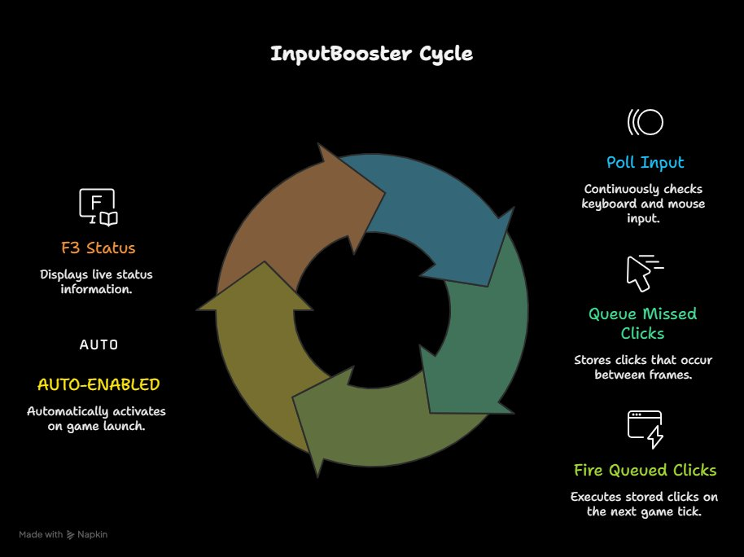
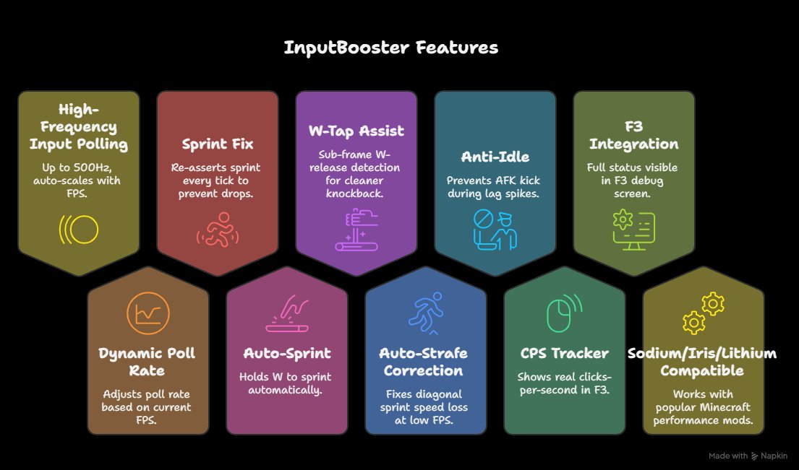
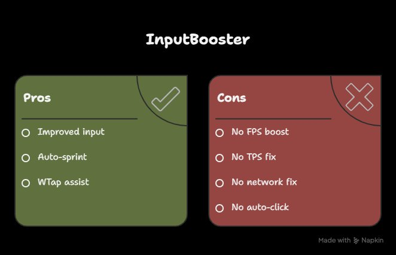

# ⚡ InputBooster

<div align="center">


**Ultra-fast input polling for competitive Minecraft PvP**  
Never miss a click again, even at low FPS 🎯

[Installation](#-installation) • [Features](#-features) • [Configuration](#%EF%B8%8F-configuration) • [How It Works](#-how-it-works)



</div>

---

## 🤔 What is this?

InputBooster is a **client-side Fabric mod** that runs a high-frequency background thread (100-500Hz) to poll your keyboard and mouse **independently of your FPS**. 

When your game is running at 20 FPS, vanilla Minecraft only checks your inputs 20 times per second. With InputBooster, your inputs are captured up to **500 times per second** and queued to fire on the next game tick.

**The cycle shown above runs automatically** - no configuration needed. Just install and play!

---

## ✨ Features

<div align="center">



</div>

### Core Systems Explained

- 🎯 **High-Frequency Input Polling** (100-500Hz)
  - Automatically scales based on your FPS
  - 20 FPS → 500Hz boost | 30 FPS → 350Hz boost
  - 60 FPS → 200Hz boost | 60+ FPS → 100Hz (maintenance mode)

- 🏃 **Sprint Fix Engine**
  - Re-asserts sprint state every tick
  - Prevents sprint-drops during lag spikes

- 👊 **W-Tap Assist**
  - Sub-frame W-release detection
  - Cleaner knockback combos

- 🎮 **Auto-Strafe Correction**
  - Fixes diagonal sprint speed loss
  - Maintains momentum at low FPS

- 📊 **Real-Time CPS Tracker**
  - Shows actual clicks-per-second in F3

- 🔄 **Anti-Idle Protection**
  - Prevents AFK kicks during lag spikes

### 🖥️ F3 Debug Integration

Press **F3** to see live mod status:

```
[InputBooster 2.0.0] ACTIVE
Poll Rate   : 350 Hz (high boost)
Client FPS  : 28
Recovered   : 1,482 inputs
CPS         : 8
Sprint Fix  : ON  | Auto-Sprint : ON
W-Tap       : ON  | Auto-Strafe : ON
Anti-Idle   : ON
by Ahaduzzaman Khan
```

---

## 📥 Installation

### Requirements

- ✅ Minecraft **1.21.x**
- ✅ [Fabric Loader](https://fabricmc.net/use/) **0.16.0+**
- ✅ [Fabric API](https://modrinth.com/mod/fabric-api)
- ✅ Java **21+**

### Steps

1. Download the latest `.jar` from [Releases](https://github.com/ahaduzzamankhan/inputbooster/releases)
2. Place it in `.minecraft/mods/`
3. Launch Minecraft with Fabric
4. **That's it!** The mod is auto-enabled on launch

### Compatibility

✅ **Works with:**
- Sodium
- Iris
- Lithium
- OptiFabric
- Most performance mods

⚠️ **May conflict with:**
- Other input-modifying mods
- Macro/autoclicker mods

---

## ⚙️ Configuration

Config file: `.minecraft/config/inputbooster.properties`

```properties
# Polling rate (Hz) - higher = more responsive
# Range: 100-500 | Default: 200
poll_rate_hz=200

# Enable sprint-fix system
sprint_fix=true

# Enable auto-sprint (hold W = sprint)
auto_sprint=true

# Enable W-tap assist for combos
wtap_assist=true

# Enable anti-idle protection
anti_idle=true

# Enable auto-strafe correction
auto_strafe=true

# Show info in F3 debug screen
show_f3_info=true
```

**Note:** Changes apply after restarting Minecraft

---

## 🎮 How to Use

1. **Launch the game** - InputBooster is automatically active
2. **Press F3** to view live stats
3. **Adjust settings** in `config/inputbooster.properties` if needed
4. **Play normally** - the mod works silently in the background

### Tips for Best Results

- 💡 Use **Sodium** for FPS optimization first
- 💡 Set `poll_rate_hz=500` if you have FPS < 30
- 💡 Disable `auto_sprint` if you prefer vanilla sprint
- 💡 Check F3 stats to monitor "Recovered Inputs" count

---

## 🎯 Pros & Cons

<div align="center">



</div>

### What This Means

✅ **InputBooster IS for:**
- Capturing missed clicks at low FPS
- Maintaining sprint consistency
- Improving combat responsiveness
- W-tap assistance for PvP

❌ **InputBooster CANNOT:**
- Boost your actual FPS (use Sodium/OptiFine)
- Fix server lag or TPS issues
- Reduce network latency or ping
- Auto-click or create macros (explicitly forbidden)

---

## 🔧 Building from Source

```bash
# Clone the repository
git clone https://github.com/ahaduzzamankhan/inputbooster.git
cd inputbooster

# Build the mod
./gradlew build

# Output: build/libs/inputbooster-2.0.0.jar
```


## 🤝 Contributing

Contributions are welcome! Please:

1. Fork the repository
2. Create a feature branch (`git checkout -b feature/amazing-feature`)
3. Commit your changes (`git commit -m 'Add amazing feature'`)
4. Push to the branch (`git push origin feature/amazing-feature`)
5. Open a Pull Request

---

## 📄 License

This project is licensed under the **MIT License** - see [LICENSE](LICENSE) for details.


## 🙏 Acknowledgments

- **Fabric Team** - For the excellent modding framework
- **Sodium Team** - For performance optimization inspiration
- **PvP Community** - For feedback and feature requests

---

## 📞 Support

- 🐛 **Bug Reports:** [GitHub Issues](https://github.com/ahaduzzamankhan/inputbooster/issues)
- 💬 **Discussions:** [GitHub Discussions](https://github.com/ahaduzzamankhan/inputbooster/discussions)
- 📦 **Modrinth:** [Download Page](https://modrinth.com/mod/inputbooster) ***Note:** You may not get this mod on modrinth yet. Now download from relases page. If it come to modrinth, the note will be remove.*

---

<div align="center">

**Made with ⚡ by [Ahaduzzaman Khan](https://github.com/ahaduzzamankhan)**

*If this mod helped you, consider starring the repo!* ⭐

</div>
